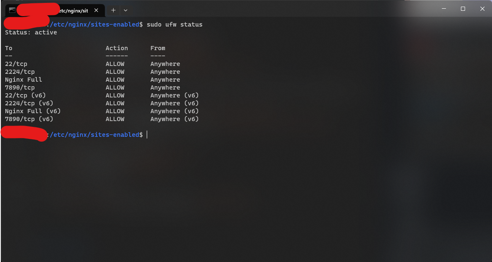

## 1 题目
个人主页：给自己建立一个主页，对自己进行介绍

## 2 需求分析与设计
### 2.1 需求分析
| 序号 | 需求名称 | 需求描述 | 解决方案 | 重要度 |
| ----- | ----- | ----- | ----- | ------ |
| 1 | 个人主页 | 给自己建立一个主页，对自己进行介绍 | 制作一个或多个静态前端页面 | P0 |
| 2 | 前端页面 | 建立前端页面展示系统 | 使用 Nginx 搭建服务器 | P1 |
| 3 | html/CSS | 使用 html 与 CSS 建立前端 | 使用 PHP 生成 html 页面，并在页面 head 中链接 CSS | P1 |
| 4 | 安全性 | PHP 防注入 | 在 Nginx 配置文件对 PHP 传入参数进行过滤 | P1 |
| 5 | 快速构建前端 | 使用比手写 html 更快捷的方式构建前端页面 | 使用 PHP 调用 Github API 对 Markdown 渲染直接生成 html 页面 | P2 |
| 6 | 域名 | 将构建的网站绑定至域名 | 注册域名并将其 A 记录解析至服务器，同时对 Nginx 进行配置 | P3 |
| 7 | 网络流量均衡 | 使用 CDN 预分发内容 | 使用 Cloudflare 对网站进行代理 | P4 |

### 2.2 系统设计


## 3 系统实现与使用方法
### 3.1 系统开发环境
- Ubuntu 22.04.2 LTS (GNU/Linux 5.15.0-73-generic x86_64)
- nginx/1.18.0
- PHP 8.1.2-1ubuntu2.11

### 3.2 系统界面简介
系统界面为浏览器静态页面。

### 3.3 系统功能模块简介
- Cloudflare  
  系统使用 Cloudflare 对页面进行缓存，通过 CDN 进行加速访问。
- Nginx  
  系统使用 Nginx 建立 https 服务，并将对 Markdown 页面的请求作为参数 `f` 转发至 md.php。
- PHP  
  当 md.php 被调用时，首先根据参数 `f` 读取 md 文件内容，然后通过 POST 请求向 <https://api.github.com/markdown> 获取渲染后的 html 内容片段，将渲染后的 html 片段作为 `article` 元素与 html 页面其余内容进行拼接后返回。


### 3.4 使用手册
1. 配置 Nginx  
   参考 [nginx.conf](nginx.conf) 内容配置 Nginx 服务器。  
   其中  
   ```nginx
    location ~ \.php$ {
        set $error_flag 0;
        if ($uri ~* "^/md.php$") {
            set $error_flag "${error_flag}1";
        }
        if ($arg_f !~ "\.md$") {
            set $error_flag "${error_flag}2";
        }
        if ($error_flag = "012") {
            return 403;
        }

        include fastcgi.conf;
        fastcgi_pass   127.0.0.1:${FASTCGI_PORT};
        fastcgi_index  index.php;
        fastcgi_split_path_info ^(.+\.php)(/.+)$;
        fastcgi_param PATH_INFO $fastcgi_path_info;
        fastcgi_param PATH_TRANSLATED $document_root$fastcgi_path_info;
        fastcgi_param SCRIPT_FILENAME $document_root$fastcgi_script_name;
    }
   ```
   向 md.php 发起页面渲染请求并对参数进行检查。  
   ```nginx
    location ~ \.md$ {
        rewrite ^/([^?]*)(?:\?(.*))? /md.php?f=$1&$2 last;
    }
   ```
   通过 rewrite 将 xxxx.md 的请求转发给 md.php?f=xxxx.md.
2. 将 md.php 与存放 CSS 的 styles 目录拷贝至网站根目录中。
3. 在网站目录中建立 Markdown 页面，视情况在 Nginx 配置文件中将 index.md 设为网站默认页面。

## 4 运行实例与功能测试
### 4.1 系统功能测试
1. 首先购买域名 `daw.org.cn` 与云服务器一台  
   
   
   

2. 将测试域名 `node0.daw.org.cn` 解析至服务器 ipv4 地址并使用 Cloudflare 代理
   
   

3. 搭建 Nginx 服务与 PHP 服务
   
   

4. 配置 ufw 与 Nginx，部署 SSL 证书
   
   
   
   

5. 拷贝 md.php 与 styles 目录到网站根目录
   

6. 编写 Markdown 页面
   

### 4.2 运行实例
访问 <https://node0.daw.org.cn/> 可见渲染后的静态页面。


## 5 总结
### 5.1 总结
一直都想做这种既简单又快速的搭建静态页面网站的东西，一顿踩坑之后终于做完了。  
没有比 Markdown 构建页面更快的了。

### 5.2 进一步改进
- 性能优化
- 页面结构优化
- Latex支持
- Mermaid支持

## 6 对本课程的建议
无

## 7 附录——源程序
[nginx.conf](nginx.conf)
```nginx
server {
    listen 443 ssl http2;
    listen [::]:443 ssl http2;

    server_name ${HOST_NAME};
    root ${PATH_TO_SITE_ROOT};
    index index.html index.htm index.php index.md;

    ssl_certificate ${PATH_TO_CERT};
    ssl_certificate_key ${PATH_TO_KEY};
    ssl_ciphers ECDHE-RSA-AES128-GCM-SHA256:ECDHE:ECDH:AES:HIGH:!NULL:!aNULL:!MD5:!ADH:!RC4;
    ssl_protocols TLSv1.1 TLSv1.2 TLSv1.3;

    location / {
        root ${PATH_TO_SITE_ROOT};
        index index.html index.htm index.php index.md;
    }

    location /.git {
        return 403;
    }

    location /doc {
        return 403;
    }

    location ~ \.php$ {

        set $error_flag 0;
        if ($uri ~* "^/md.php$") {
            set $error_flag "${error_flag}1";
        }
        if ($arg_f !~ "\.md$") {
            set $error_flag "${error_flag}2";
        }
        if ($error_flag = "012") {
            return 403;
        }

        include fastcgi.conf;
        fastcgi_pass   127.0.0.1:${FASTCGI_PORT};
        fastcgi_index  index.php;
        fastcgi_split_path_info ^(.+\.php)(/.+)$;
        fastcgi_param PATH_INFO $fastcgi_path_info;
        fastcgi_param PATH_TRANSLATED $document_root$fastcgi_path_info;
        fastcgi_param SCRIPT_FILENAME $document_root$fastcgi_script_name;
    }

    location ~ \.md$ {
        rewrite ^/([^?]*)(?:\?(.*))? /md.php?f=$1&$2 last;
    }
}
```

[test.php](../test.php)
```php
<?php
	phpinfo();
?>
```

[md.php](../md.php)
```php
<?php
function curl_raw($url, $content) {
    $curl = curl_init($url);
    curl_setopt($curl, CURLOPT_HEADER, false);
    curl_setopt($curl, CURLOPT_RETURNTRANSFER, true);
    curl_setopt($curl, CURLOPT_HTTPHEADER,
        array("Content-type: application/json",
              "User-Agent: " . $_SERVER['HTTP_USER_AGENT']));
    curl_setopt($curl, CURLOPT_POST, true);
    curl_setopt($curl, CURLOPT_POSTFIELDS, $content);
    curl_setopt($curl, CURLOPT_SSL_VERIFYPEER, false);

    $json_response = curl_exec($curl);

    $status = curl_getinfo($curl, CURLINFO_HTTP_CODE);

    curl_close($curl);

    return $json_response;
}

$markdown_filename = $_GET['f'];

$markdown_text = file_get_contents($markdown_filename);

$render_url = 'https://api.github.com/markdown';

$request_array['text'] = $markdown_text;
$request_array['mode'] = 'markdown';

$html_article_body = curl_raw($render_url, json_encode($request_array));

echo '<!DOCTYPE html><html lang="zh-CN"><head><meta charset="utf-8">';
echo '<title>' . $markdown_filename . '</title>';
echo '<link rel="stylesheet" type="text/css" href="styles/base.css">';
echo '<link rel="stylesheet" type="text/css" href="styles/checkboxes.css">';
echo '<link rel="stylesheet" type="text/css" href="styles/github-markdown.css">';
echo '<link rel="stylesheet" type="text/css" href="styles/highlight-js.css">';
echo '<link rel="stylesheet" type="text/css" href="styles/katex.min.css">';
echo '</head>';
echo '<body class="dark"><div class="content"><article class="markdown-body entry-content container-lg" itemprop="text">';
echo $html_article_body;
echo '</article></div></body></html>';
```

[styles/base.css](../styles/base.css)
```css
html,
body{
    padding: 0 !important;
    max-width: auto !important;
}

html,
body{
    background-color: var(--color-canvas-default);
    color: var(--color-fg-default);
}

.content{
    padding: 0px;
    max-width: 1100px;
    margin-top: 0px;
    margin-right: auto;
    margin-bottom: 0px;
    margin-left: auto;
}
```
其余代码见 <https://github.com/FangCunWuChang/php-github-markdown>.
