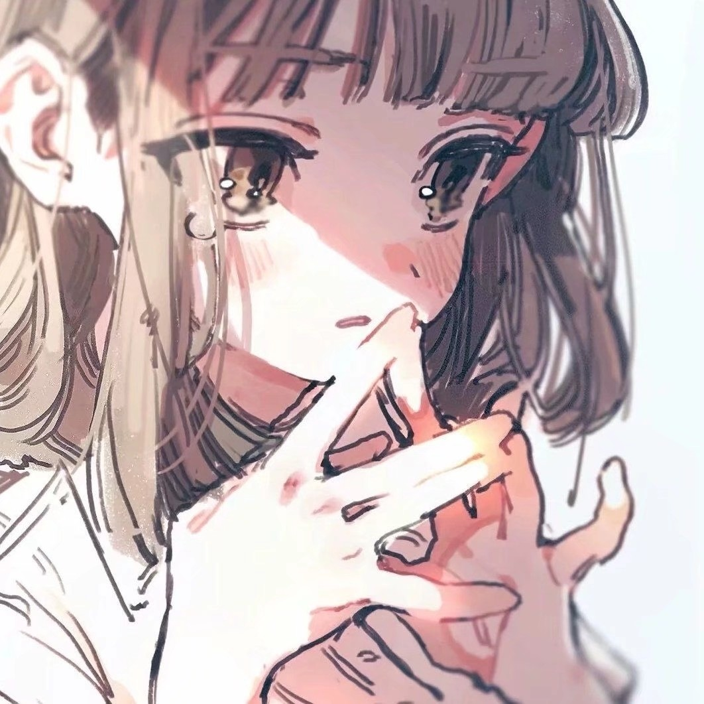
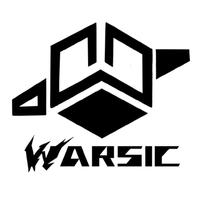

# 無常
  

- C++/Lua 开源开发者
- 音乐策划，作词，虚拟歌姬调教
- 擅长 DAW （数字音频工作站）与虚拟歌姬开发
- 就读于合肥工业大学计算机科学与技术专业
- Warsic 音乐社团宣传部，B 站运营，《某企划》主策划
- 代表作 VocalShaper、LUCE
- 故乡吉林长春，现居安徽宣城
- email: <3142324836@qq.com>

---

## 我的态度

---

## 作为开发者

### 代表作

### 项目信息
- 🔭 我正在使用 LUCE 框架开发，它是一个可以把 C++ 类绑定到 Lua 的框架。  
- 🌱 我正在学习 C++ 新标准和 Lua 5.4。
- 👯 我正在为一个新的开源 DAW 项目的开发寻求合作者。  
- 💬 可以向我咨询 DAW 与音频插件开发或虚拟歌姬相关技术。   

### Github 主页
- <https://github.com/FangCunWuChang>

    
    

 

### VocalShaper 项目
- 项目 Github：<https://github.com/Do-sth-sharp>
- 项目 B 站主页：<https://space.bilibili.com/2060981097>

---

## 作为音乐策划
### 我的社团
 
Warsic音乐社团是一个以创作、交流、推广国产纯音乐为目的的纯音乐社团。

#### 社团链接
- B 站：<https://space.bilibili.com/2011729430>
- 网易云：<https://music.163.com/artist?id=47917455>
- 微博：<https://weibo.com/u/5346479554>
- QQ 音乐：<https://y.qq.com/n/ryqq/singer/004eJd6F07tvaE>
- 小红书：

### 我的作品
- [【洛天依原创】天街灯【無常】【落泪】【feat. 乐正绫】](https://www.bilibili.com/video/BV1o541147i5)
- [【洛天依AI】那年烟花绚烂时，为何没有遇见你（Cover叶里）](https://www.bilibili.com/video/BV18M4y147oF)
- [【乐正绫AI日语】春よ、来い（Cover松任谷由実）【昭和风MV付】](https://www.bilibili.com/video/BV1YP411R7CD)

### 向我约稿
- 接受无偿稿，具体做不做还要看兴趣
- 作词随缘，风格参考《天街灯》，产出速度不高
- 调教的话擅长洛天依V4/ACE，乐正绫ACE，星尘V4

### 我的音乐企划
#### 某企划
- 企划主题：用歌曲讲述故事。
- 企划内容：
> 1.	从企划成员处征集短篇及超短篇小说类的原创故事（以虚构为主）；感情丰富，情节跌宕，引人深思为优。
> 2.	围绕第1条中所征集的故事，制作原创歌曲与歌曲PV。将第1条中的故事作为歌曲的文案。
> 3.	将制作的歌曲（人声与虚拟歌姬双本家）以联合投稿的形式投稿至B站及音乐平台。
- 企划周期：长期企划
- 企划参与人员：以企划长期参与人员为主，空缺职务动态寻求合作。
- 投稿频率：不定期更新，以质量与艺术性为主，作品应精细打磨，以作品产出频率为投稿频率。
- 参与人员要求：
> 1.	具备一定的专业素养或学习能力。
> 2.	有耐心，能精益求精地打磨作品。
- 备注：
> 1.	企划中作品以双本家为主，若实在缺少某一本家的制作人员可只发布单一本家，另一本家的制作待未来补充。

---

## 联系我
- email: <3142324836@qq.com> <Warsic.WuChang@gmail.com>
- Bilibili: <https://space.bilibili.com/161161623>
- QQ: 3142324836

---

<image align="left" src ="https://komarev.com/ghpvc/?username=WuChang&style=for-the-badge&color=da69ac" width="160" height="36"/>