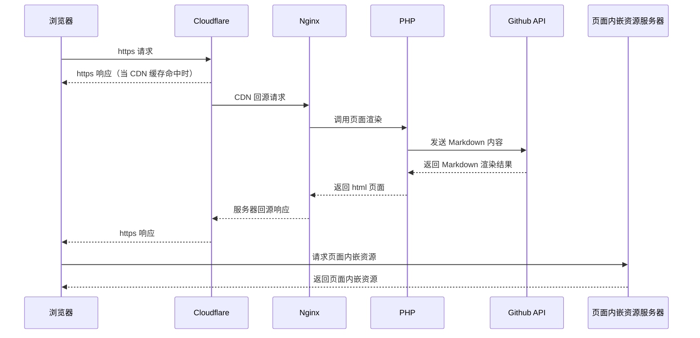

```mermaid
sequenceDiagram
    participant 浏览器
    participant Cloudflare
    participant Nginx
    participant PHP
    participant Github API
    participant 页面内嵌资源服务器
    浏览器->>Cloudflare: https 请求
    Cloudflare-->>浏览器: https 响应（当 CDN 缓存命中时）
    Cloudflare->>Nginx: CDN 回源请求
    Nginx->>PHP: 调用页面渲染
    PHP->>Github API: 发送 Markdown 内容
    Github API-->>PHP: 返回 Markdown 渲染结果
    PHP-->>Nginx: 返回 html 页面
    Nginx-->>Cloudflare: 服务器回源响应
    Cloudflare-->>浏览器: https 响应
    浏览器->>页面内嵌资源服务器: 请求页面内嵌资源
    页面内嵌资源服务器-->>浏览器: 返回页面内嵌资源
```